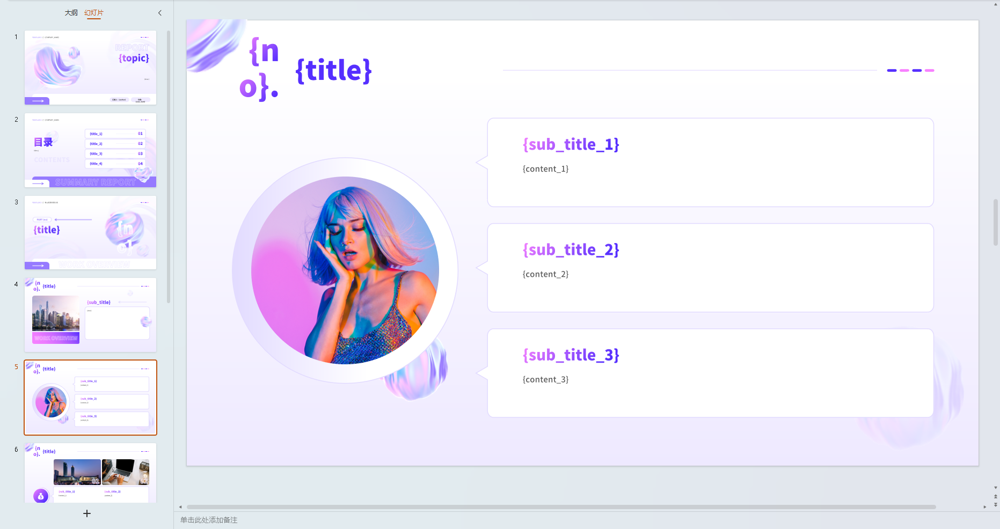
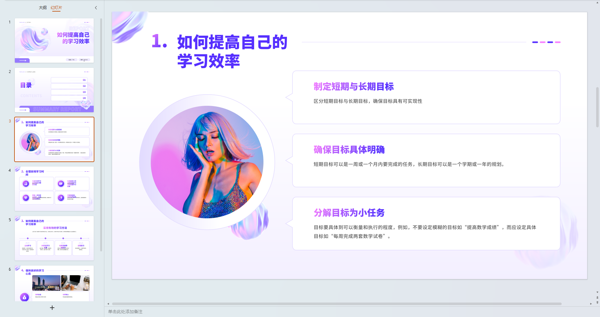
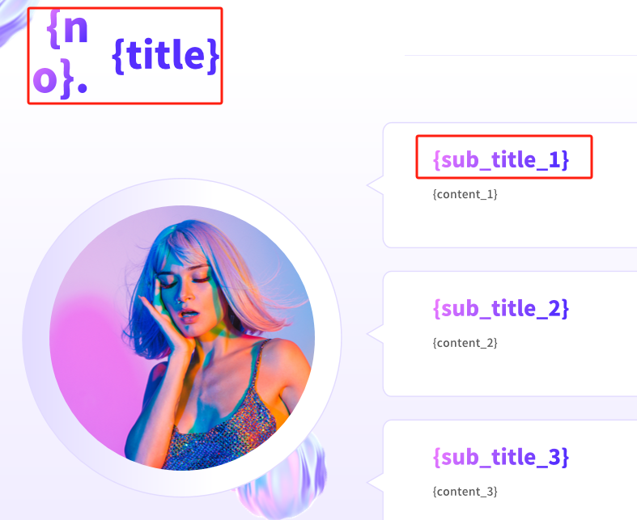

# ai-pptx 

😆 Generate PPT by LLM follow your template.

📢 Not only use llm to generate ppt, but also according to your favorite ppt template. Just you need to simply change the template parameters.

## ShowCase
| Template                                 | Generated Slide                               |
|------------------------------------------|-------------------------------------------|
|  |  |

## Installation

> python >= 3.10

1. Clone the [setting-example.json](./setting-example.json) and update your own llm api key `llm -> api_key`

```
$ cp setting-example.json setting.json
```

2. Install the dependencies

```
$ pip install -r requirements.txt
```

## Run in Gradio

```
$ python run.py
```

## How to use personal pptx template ?

Because there is no relatively stable extraction parameter scheme, the use of personal ppt templates needs to do their own parameterization and semantization.

### Parameterization

For each text box, you need to use the `{param}` to fill it back. 

#### For example:



### Semantization

And above parameter name can be customized, but because it needs to be understood by the LLM, **you must include semantics**. If need the Number to sort, you need to fill `[sth]_[no]` as the parameter name.

#### For example:

If the textbox is filled by title info, you should be fill it with `title`.

If the textbox is filled by the content of the first paragraph, you should be fill it with `content_1`.

If the textbox is filled by the content of the second paragraph, you should be fill it with `content_2`.


## Features

- &#9745; Generate PPT by LLM
- &#9745; New PPT follow your template
- &#9745; Support gradio app
- &#9744; Generate all content by Agent

## License

Licensed under the [MIT](./LICENSE).

## Contact

See the homepage ;)